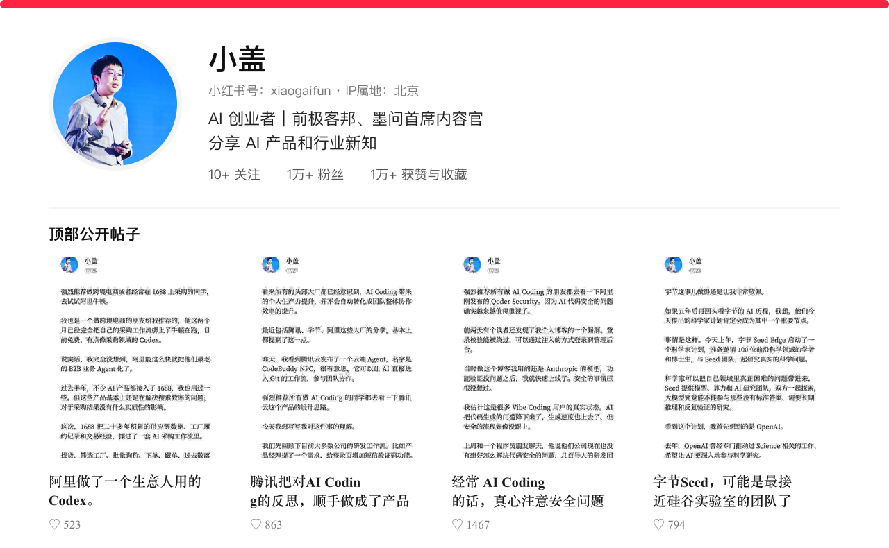

# 小盖：内容情报与溯源档案

> 数据快照：2026-07-26 · 证据等级只表示来源链完整度，不表示观点一定正确。

中文科技圈的信息策展人：稳定完成“找材料、炼判断、落行动”，帮助读者缩短从发现信息到理解并使用信息的路径。

> 小红书公开账号信息与顶部帖子，采集于 2026-07-26。点击下方主页入口可查看当前页面。

> 链接说明：档案只保存不含 Cookie、`xsec_token` 等临时鉴权参数的稳定地址。小红书原帖直链可能因登录状态或分享上下文跳到安全页；这不等于档案没有配置链接。没有可靠笔记 ID 的条目会明确标为“原帖链接待补”，不会猜测地址。

- 公开笔记：**828 篇**
- 近 92 天：**103 篇**
- 遍历区间：2025-01-14 — 2026-07-23
- 主页：[xiaohongshu](https://xhslink.cn/m/4Huf2tL6sG3)

## 一页判断

- 选材好：长期从 X、播客、直播、演讲和官方发布中寻找高密度原材料，而不是只追逐平台内的工具热点。
- 提炼强：不平均复述长内容，而是抓住最有张力的问题，把它压成中文读者能记住、愿意转发的判断。
- 有行动感：最终总会回到“这和普通人的工作、学习与选择有什么关系”，让信息变成可尝试的动作。

## 内容方法

他不是工具说明书型账号，更接近中文科技圈的信息策展人。

| 环节 | 稳定能力 | 代表例子 |
|---|---|---|
| 会找 | 跨平台寻找正在产生新判断的高质量原材料。 | X 上的 AI Builder 与新产品；Lenny's Podcast 等产品播客；Anthropic 官方访谈与研究；直播、演讲和行业论坛 |
| 会炼 | 从长内容里抓住一个最有张力的问题，形成清晰、可记忆的中文判断。 | Agency 比技能更耐久；AI 是工具还是拐杖；失败是下一次原型的反馈 |
| 会落地 | 把趋势和观点继续翻译成提示词、工作流或普通人可以马上尝试的动作。 | 先采访、后执行提示词；Codex 非编程工作流；从日常摩擦寻找 Vibe Coding 点子 |

## 信息源地图

| 来源渠道 | 代表内容 |
|---|---|
| X / AI Builder | OpenClaw Wrapper；新产品与创业判断 |
| 播客 | Notion 产品负责人 Max Schoening；James Dyson × David Senra |
| 官方访谈与研究 | Anthropic 四名大学生访谈；Anthropic Education Report |
| 直播、演讲与论坛 | Tim × 天猫 AI 数码直播；智能体创新与治理论坛 |

## 给读者的价值

- 替读者跨平台寻找并筛选高密度信息。
- 替读者完成“什么最值得记住”的判断。
- 给出继续阅读、验证或亲手尝试的入口。

## 近92天点赞 Top 10

| # | 日期 | 赞 | 内容 |
|---:|---|---:|---|
| 1 | 2026-04-29 | 8,255 | [Tim 昨晚的直播，特别有意思](https://www.xiaohongshu.com/explore/69f214a6000000003601a674 "小红书可能要求登录或有效的分享上下文") |
| 2 | 2026-07-02 | 8,200 | [Codex 的终极使用教程](https://www.xiaohongshu.com/explore/6a46195900000000220184df "小红书可能要求登录或有效的分享上下文") |
| 3 | 2026-05-14 | 5,830 | 真神，有人开始给母校捐 Token 了（原帖链接待补） |
| 4 | 2026-04-30 | 5,818 | 黄仁勋对 AI 的理解真的是一针见血（原帖链接待补） |
| 5 | 2026-05-11 | 5,374 | 马嘉祺给所有 AI 都上了一课（原帖链接待补） |
| 6 | 2026-05-30 | 4,332 | 给表妹使用 AI 的建议（原帖链接待补） |
| 7 | 2026-05-20 | 3,199 | B 站已经变成了 AI 技术广场（原帖链接待补） |
| 8 | 2026-06-09 | 3,145 | [总结下我使用 Codex 的 8 个高频场景](https://www.xiaohongshu.com/explore/6a27cfd1000000003501fa83 "小红书可能要求登录或有效的分享上下文") |
| 9 | 2026-06-04 | 3,075 | Claude 封号后，我用上了文科生的 Codex（原帖链接待补） |
| 10 | 2026-07-14 | 2,565 | Agent 互联（原帖链接待补） |

## 全历史点赞 Top 10

| # | 日期 | 赞 | 内容 |
|---:|---|---:|---|
| 1 | 2025-12-17 | 约5.6万 | 迄今为止，对我影响最大的视频之一（原帖链接待补） |
| 2 | 2025-09-21 | 约4.2万 | 俞敏洪这段话说的直击我心（原帖链接待补） |
| 3 | 2026-02-23 | 2.4万 | [让我非常震撼的 OpenClaw 玩法](https://www.xiaohongshu.com/explore/699c650b0000000016009213 "小红书可能要求登录或有效的分享上下文") |
| 4 | 2026-01-04 | 1.5万 | [最近调了一个非常好用的提示词](https://www.xiaohongshu.com/explore/695a1e45000000001e0215f1 "小红书可能要求登录或有效的分享上下文") |
| 5 | 2025-04-15 | 约1.5万 | 也许建立自尊的一种方式（原帖链接待补） |
| 6 | 2025-05-10 | 9,869 | 提高设计审美，我会推荐三本书（原帖链接待补） |
| 7 | 2026-02-17 | 9,266 | 不瞒大家，我昨晚被 AI 刺激到了（原帖链接待补） |
| 8 | 2025-09-09 | 9,232 | 要是早点看到这个关于亲密关系的视频就好了（原帖链接待补） |
| 9 | 2026-04-29 | 8,255 | [Tim 昨晚的直播，特别有意思](https://www.xiaohongshu.com/explore/69f214a6000000003601a674 "小红书可能要求登录或有效的分享上下文") |
| 10 | 2026-03-10 | 8,248 | 所有的龙虾教程都去见鬼吧（原帖链接待补） |

## 10 篇重点内容

| 日期 | 笔记 | 赞 | 主题 | 为什么入选 |
|---|---|---:|---|---|
| 2026-02-23 | [让我非常震撼的 OpenClaw 玩法](https://www.xiaohongshu.com/explore/699c650b0000000016009213 "小红书可能要求登录或有效的分享上下文") | 2.4万 | Agent / OpenClaw / AI 产品 / 创业 | 历史 AI 内容中热度与转发最强，且存在可验证的产品能力和可复现商业假设。 |
| 2026-01-04 | [最近调了一个非常好用的提示词](https://www.xiaohongshu.com/explore/695a1e45000000001e0215f1 "小红书可能要求登录或有效的分享上下文") | 1.5万 | 提示词 / 工作流 / 需求澄清 | 收藏意图极强，机制清晰，适合用 A/B 测试复现。 |
| 2025-12-09 | [被震到了，听过含金量最高的一期职场播客](https://www.xiaohongshu.com/explore/6937cc24000000001b022135 "小红书可能要求登录或有效的分享上下文") | 5,851 | 播客 / 创业 / 产品 / 迭代 | 原节目稳定可溯源，适合连接 AI 原型迭代与创始人反馈回路。 |
| 2026-01-15 | [真心推荐大家都看看这期播客](https://www.xiaohongshu.com/explore/6968e452000000001a02a18b "小红书可能要求登录或有效的分享上下文") | 5,591 | 播客 / 教育 / Anthropic / 学习 | 有官方访谈与研究报告，可对照“代写式”和“学习式”AI 使用。 |
| 2026-04-29 | [Tim 昨晚的直播，特别有意思](https://www.xiaohongshu.com/explore/69f214a6000000003601a674 "小红书可能要求登录或有效的分享上下文") | 8,255 | AI 视频 / AI 硬件 / 直播 | 近92天热度第一，但完整直播回放未找到，适合作为 B 级案例。 |
| 2026-07-02 | [Codex 的终极使用教程](https://www.xiaohongshu.com/explore/6a46195900000000220184df "小红书可能要求登录或有效的分享上下文") | 8,200 | Codex / 知识工作 / AI Coding | 近期收藏意图最强；官方定位可核验，但“连接 Kimi”未获官方支持验证。 |
| 2026-06-09 | [总结下我使用 Codex 的 8 个高频场景](https://www.xiaohongshu.com/explore/6a27cfd1000000003501fa83 "小红书可能要求登录或有效的分享上下文") | 3,145 | Codex / 知识工作 / Skill / 自动化 | 三个开源 Skill 均可溯源，适合拆成连续复现实验。 |
| 2026-07-06 | [怎么找 Vibe Coding 的点子](https://www.xiaohongshu.com/explore/6a4b9ce1000000001003ed1c "小红书可能要求登录或有效的分享上下文") | 2,305 | Vibe Coding / 产品 / 创业 | 方法论可复现，但“知乎 AI Works”稳定公开入口尚未找到。 |
| 2026-06-16 | [最近半年听过最好的一期 AI 播客](https://www.xiaohongshu.com/explore/6a313d7c0000000011012cdd "小红书可能要求登录或有效的分享上下文") | 1,902 | 播客 / Notion / Agency / Taste / 产品 | 原节目稳定可溯源，能从金句升级成可执行训练。 |
| 2026-04-30 | [最近我经历了一起 Agent 安全事故](https://www.xiaohongshu.com/explore/69f2f875000000003803561c "小红书可能要求登录或有效的分享上下文") | 2,009 | Agent / 安全 / 权限 / API | 论坛活动可核验；事故原因只是推断，适合展示证据边界与安全清单。 |

## 提及对象、相关原帖与原始链接

| 对象 | 类型 | 内容 | 相关原帖 | 来源与证据 |
|---|---|---|---|---|
| OpenClaw | product | 支持渠道、Skills/Plugins、记忆、浏览器和自动化的通用 Agent；小盖关注的是把它包装成垂直数字员工。 | [让我非常震撼的 OpenClaw 玩法](https://www.xiaohongshu.com/explore/699c650b0000000016009213 "小红书可能要求登录或有效的分享上下文") 所有的龙虾教程都去见鬼吧（原帖链接待补） | [A · OpenClaw 官网](https://openclaw.ai/) [A · OpenClaw 官方 GitHub](https://github.com/openclaw/openclaw) [A · OpenClaw Automation 文档](https://docs.openclaw.ai/automation) |
| OpenClaw Wrapper 原始 X 帖 | article | 小盖附件中出现的五类垂直 Wrapper 构想，其公开稳定原文作者尚未确认。 | [让我非常震撼的 OpenClaw 玩法](https://www.xiaohongshu.com/explore/699c650b0000000016009213 "小红书可能要求登录或有效的分享上下文") | C · OpenClaw Wrapper 附件的原始 X 作者（未解决） |
| 先采访、后执行提示词 | prompt | 先结构后细节、一次一个问题、允许追问、最多20问，再围绕结果执行。 | [最近调了一个非常好用的提示词](https://www.xiaohongshu.com/explore/695a1e45000000001e0215f1 "小红书可能要求登录或有效的分享上下文") | [A · 小盖笔记：最近调了一个非常好用的提示词](https://www.xiaohongshu.com/explore/695a1e45000000001e0215f1) |
| James Dyson × David Senra | podcast | 围绕5,127次原型、失败反馈、招聘与创始人保持亲手做的访谈。 | [被震到了，听过含金量最高的一期职场播客](https://www.xiaohongshu.com/explore/6937cc24000000001b022135 "小红书可能要求登录或有效的分享上下文") | [A · James Dyson: 5,127 Prototypes / David Senra](https://youtu.be/Se64B8TKfjA) |
| Anthropic 四名大学生 AI 使用访谈 | podcast | 对比把 AI 当代写捷径和苏格拉底式学习伙伴的四个真实案例。 | [真心推荐大家都看看这期播客](https://www.xiaohongshu.com/explore/6968e452000000001a02a18b "小红书可能要求登录或有效的分享上下文") | [A · Real AI usage stories from four college students](https://www.youtube.com/watch?v=N5yJJA0NCU0) |
| Claude for Education | product | Anthropic 面向教育场景的官方产品与学习模式说明。 | [真心推荐大家都看看这期播客](https://www.xiaohongshu.com/explore/6968e452000000001a02a18b "小红书可能要求登录或有效的分享上下文") | [A · Introducing Claude for Education](https://www.anthropic.com/news/introducing-claude-for-education) |
| Anthropic Education Report | paper | Anthropic 关于大学生如何使用 Claude 的官方研究。 | [真心推荐大家都看看这期播客](https://www.xiaohongshu.com/explore/6968e452000000001a02a18b "小红书可能要求登录或有效的分享上下文") | [A · Anthropic Education Report](https://www.anthropic.com/research/anthropic-education-report-how-university-students-use-claude) |
| Tim × 天猫 AI 数码新品发布盛典 | event | 2026-04-28商业合作直播；活动可核实，完整回放与逐字观点未找到。 | [Tim 昨晚的直播，特别有意思](https://www.xiaohongshu.com/explore/69f214a6000000003601a674 "小红书可能要求登录或有效的分享上下文") | [B · 天猫联袂影视飓风，下一代 AI 硬件如何引爆大众市场](https://k.sina.cn/article_7879848900_1d5acf3c406802yvwy.html?from=tech) C · Tim × 天猫 AI 数码完整直播回放（未解决） |
| Codex | product | 不只写代码，也覆盖研究、报告、表格、演示文稿和其他知识工作。 | [Codex 的终极使用教程](https://www.xiaohongshu.com/explore/6a46195900000000220184df "小红书可能要求登录或有效的分享上下文") [总结下我使用 Codex 的 8 个高频场景](https://www.xiaohongshu.com/explore/6a27cfd1000000003501fa83 "小红书可能要求登录或有效的分享上下文") Claude 封号后，我用上了文科生的 Codex（原帖链接待补） | [A · Introducing the Codex app](https://openai.com/index/introducing-the-codex-app/) [A · Codex use cases](https://developers.openai.com/codex/use-cases) [A · Codex for knowledge work](https://openai.com/index/codex-for-knowledge-work/) |
| Codex 连接 Kimi | workflow | 小盖笔记中的配置步骤；未在 OpenAI 官方公开文档中找到支持说明。 | [Codex 的终极使用教程](https://www.xiaohongshu.com/explore/6a46195900000000220184df "小红书可能要求登录或有效的分享上下文") | C · Codex 连接 Kimi 的官方支持说明（未解决） |
| Excalidraw Diagram Skill | open_source | 用于生成 Excalidraw 流程图和架构图的开源 Skill。 | [总结下我使用 Codex 的 8 个高频场景](https://www.xiaohongshu.com/explore/6a27cfd1000000003501fa83 "小红书可能要求登录或有效的分享上下文") | [A · Excalidraw Diagram Skill](https://github.com/coleam00/excalidraw-diagram-skill) |
| Ian Xiaohei Illustrations | open_source | 小盖在 Codex 配图工作流中给出的手绘插图开源项目。 | [总结下我使用 Codex 的 8 个高频场景](https://www.xiaohongshu.com/explore/6a27cfd1000000003501fa83 "小红书可能要求登录或有效的分享上下文") | [A · Ian Xiaohei Illustrations](https://github.com/helloianneo/ian-xiaohei-illustrations) |
| Note Slides | open_source | 把笔记或长文转换为 Slides 的开源项目。 | [总结下我使用 Codex 的 8 个高频场景](https://www.xiaohongshu.com/explore/6a27cfd1000000003501fa83 "小红书可能要求登录或有效的分享上下文") | [A · Note Slides](https://github.com/gainubi/note-slides) |
| 知乎 AI Works | platform | 小盖提到的新产品展示入口；稳定公开入口尚未找到。 | [怎么找 Vibe Coding 的点子](https://www.xiaohongshu.com/explore/6a4b9ce1000000001003ed1c "小红书可能要求登录或有效的分享上下文") | C · 知乎 AI Works 稳定公开入口（未解决） |
| Max Schoening × Lenny's Podcast | podcast | Notion 产品负责人谈 agency、taste、tiny core 与“前10%免费、最后10%最难”。 | [最近半年听过最好的一期 AI 播客](https://www.xiaohongshu.com/explore/6a313d7c0000000011012cdd "小红书可能要求登录或有效的分享上下文") | [A · Why cultivating agency matters more than cultivating skills in the AI era](https://www.lennysnewsletter.com/p/why-cultivating-agency-matters-more) [A · AI era skills: Why cultivating agency matters more than job titles](https://youtu.be/mCO-D3pkviM) |
| 智能体创新与治理论坛 | event | 数字中国建设峰会官方论坛，讨论跨 Agent 身份、意图、委托权限与审计。 | [最近我经历了一起 Agent 安全事故](https://www.xiaohongshu.com/explore/69f2f875000000003803561c "小红书可能要求登录或有效的分享上下文") | [A · 第九届数字中国建设峰会“智能体创新与治理”论坛](https://www.cac.gov.cn/2026-04/29/c_1779200512939516.htm) [B · 防范智能体协作中的三大风险](https://finance.sina.cn/stock/jdts/2026-04-29/detail-inhwesks7830964.d.html?vt=4) |
| Agent 开放社区额度耗尽事故 | event | 小盖两次遇到 Kimi API 额度耗尽并轮换密钥；Key 泄露是其推断，不是公开取证结论。 | [最近我经历了一起 Agent 安全事故](https://www.xiaohongshu.com/explore/69f2f875000000003803561c "小红书可能要求登录或有效的分享上下文") | [B · 小盖笔记：最近我经历了一起 Agent 安全事故](https://www.xiaohongshu.com/explore/69f2f875000000003803561c) [B · 防范智能体协作中的三大风险](https://finance.sina.cn/stock/jdts/2026-04-29/detail-inhwesks7830964.d.html?vt=4) |

## 证据规则

- **A**：找到原节目、官方页面、原仓库、官方活动记录，或主张直接来自原始笔记。
- **B**：事件本身可核实，但具体观点来自转述或二手报道。
- **C**：只确认到笔记或附件，尚未找到公开、稳定的原始出处。

## 纠错

欢迎通过仓库 Issue 提交信息纠错、失效链接或博主本人补充。本人提交与编辑核验会分开标注，不自动视为“本人认证”。
